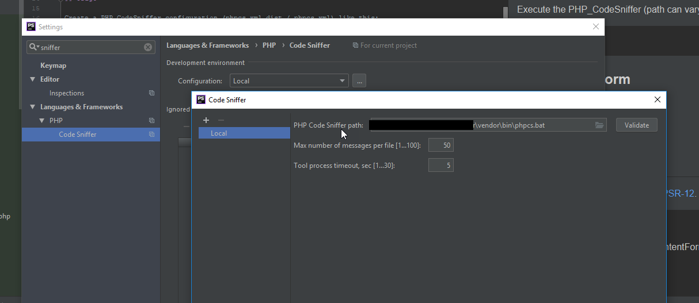
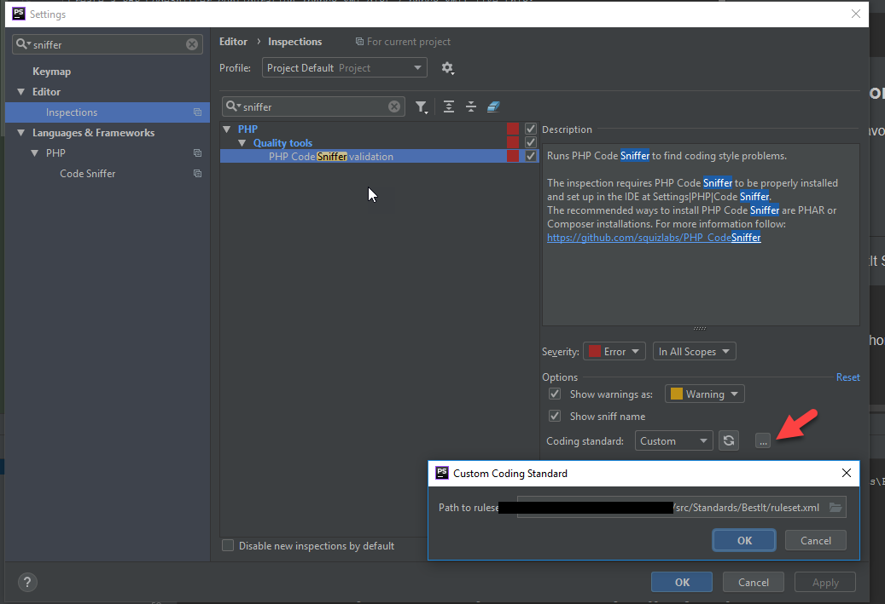

# best it PHP_CodeSniffer

[](https://travis-ci.org/bestit/php_codesniffer) [](https://scrutinizer-ci.com/g/bestit/PHP_CodeSniffer/build-status/master) [](https://scrutinizer-ci.com/g/bestit/PHP_CodeSniffer/?branch=master) [](https://scrutinizer-ci.com/g/bestit/PHP_CodeSniffer/?branch=master)

This package contains a default rule set and custom rules which are used in all best it projects.

## Installation

Our PHP_CodeSniffer package can be installed with composer with the following command:
```bash
composer require best-it/php_codesniffer --dev
```

**Please use Version 1 for PHP 7.0!**

## Usage

Create a PHP_CodeSniffer configuration (phpcs.xml.dist / phpcs.xml) like this:
```xml
<?xml version="1.0"?>
<ruleset name="PROJECT-X">
    <description>The coding standard for project x.</description>

    <!-- Path to best it ruleset. -->
    <rule ref="./vendor/best-it/php_codesniffer/src/Standards/BestIt/ruleset.xml" />

    <!-- Path to directory which are checked. -->
    <file>src/</file>
    <file>tests/</file>
</ruleset>
```

If you want to sniff for special PHP Versions just declare a ["testVersion"](https://github.com/PHPCompatibility/PHPCompatibility#using-a-custom-ruleset) like:

```xml
<config name="testVersion" value="7.1" />
```

Execute the PHP_CodeSniffer (path can vary on your composer configuration):

```bash
./vendor/bin/phpcs
```

We use warnings for things which a human person should check, but which must not fail an automatic build. If you want to 
see warnings but get successful builds, call the code sniffer with the special config option _ignore_warnings_on_exit_:

```bash
./vendor/bin/phpcs --config-set ignore_warnings_on_exit 1
```
or, if you want the option only for a single run:

```bash
./vendor/bin/phpcs --runtime-set ignore_warnings_on_exit 1
```

[Check original docs for more info.](https://github.com/squizlabs/PHP_CodeSniffer/wiki/Configuration-Options#ignoring-warnings-when-generating-the-exit-code)

If you want to ignore warnings altogether, you can provide the cli argument n:

```bash
./vendor/bin/phpcs -n
```

We suggest that you do not ignore warnings, but only check them in a manual pull/merge request.


### Use in PHPStorm

How to use it in our favorite IDE?

/File/Settings:

1. 

2. 

3. ... and choose our ruleset.

## Used sniffs

The base for the BestIt Standard is [PSR-12](https://github.com/php-fig/fig-standards/blob/master/proposed/extended-coding-style-guide.md).

| Sniff | Description | suppressable |
| ----- | ----------- | ------------ |
| BestIt.Commenting.ClassDoc.DocCommentUcFirst | Every doc comment block SHOULD start ucfirst. | no |
| BestIt.Commenting.ClassDoc.NoLineAfterDocComment | Every doc comment block (the summary or a long description paragrah) SHOULD finish with double newline. | no |
| BestIt.Commenting.ClassDoc.NoSummary | There SHOULD be a summary. | no |
| BestIt.Commenting.ClassDoc.SummaryTooLong | The summary SHOULD be in one line. | no |
| BestIt.Commenting.ConstantDoc.DocCommentUcFirst | Every doc comment block SHOULD start ucfirst. | no |
| BestIt.Commenting.ConstantDoc.NoLineAfterDocComment | Every doc comment block (the summary or a long description paragrah) SHOULD finish with double newline. | no |
| BestIt.Commenting.ConstantDoc.NoSummary | There SHOULD be a summary. | no |
| BestIt.Commenting.ConstantDoc.SummaryTooLong | The summary SHOULD be in one line. | no |
| BestIt.Commenting.EmptyLinesDoc.EmptyLinesFound | There MUST be no redundant lines in your doc block. | no |
| BestIt.Commenting.FunctionDoc.DocCommentUcFirst | Every doc comment block SHOULD start ucfirst. | no |
| BestIt.Commenting.FunctionDoc.NoLineAfterDocComment | Every doc comment block (the summary or a long description paragrah) SHOULD finish with double newline. | no |
| BestIt.Commenting.FunctionDoc.NoSummary | There SHOULD be a summary. | no |
| BestIt.Commenting.FunctionDoc.SummaryTooLong | The summary SHOULD be in one line. | no |
| BestIt.Commenting.PropertyDoc.DocCommentUcFirst | Every doc comment block SHOULD start ucfirst. | no |
| BestIt.Commenting.PropertyDoc.NoLineAfterDocComment | Every doc comment block (the summary or a long description paragrah) SHOULD finish with double newline. | no |
| BestIt.Commenting.PropertyDoc.NoSummary | There SHOULD be a summary. | no |
| BestIt.Commenting.PropertyDoc.SummaryTooLong | The summary SHOULD be in one line. | no |
| BestIt.Commenting.RedundantWhitespace.RedundantWhitespace | There MUST be no additonal spaces around your doc tags. | no |
| BestIt.Commenting.RequiredDocBlock.MissingDocBlock | There MUST be a doc block before a Class, Constant, Interface, Function, Trait, Variable. | no |
| BestIt.Commenting.RequiredDocBlock.NoMultiLineDocBlock | The doc block before a Class, Constant, Interface, Function, Trait, Variable must be multi-line. | no |
| BestIt.Comparisons.EmptyArrayForComparison.EmptyArray | You MUST not create an empty array, to check for an empty array. | no |
| BestIt.Comparisons.EqualOperator.EqualOperatorFound | You SHOULD use the "Identical" operator (===). | no |
| BestIt.DocTags.AuthorTag.TagContentFormatInvalid | You MUST commit to your codes and give an [author tag](http://docs.phpdoc.org/references/phpdoc/tags/author.html). | no |
| BestIt.DocTags.DeprecatedTag.MissingDates | The error code for the missing dates. | no |
| BestIt.DocTags.DeprecatedTag.TagContentFormatInvalid | If you provide a deprecated tag, you MUST provide it with versions since when its deprecated and when it will be removed. | no |
| BestIt.DocTags.DisallowedClassTags.TagNotAllowed | You MUST not give one of the disallowed tags in your doc comment. | no |
| BestIt.DocTags.DisallowedConstantTags.TagNotAllowed | You MUST not give one of the disallowed tags in your doc comment. | no |
| BestIt.DocTags.DisallowedMethodTags.TagNotAllowed | You MUST not give one of the disallowed tags in your doc comment. | no |
| BestIt.DocTags.DisallowedPropertyTags.TagNotAllowed | You MUST not give one of the disallowed tags in your doc comment. | no |
| BestIt.DocTags.PackageTag.TagContentFormatInvalid | You MUST provide a special tag format. | no |
| BestIt.DocTags.PackageTag.WrongPackage | If there is a namespace, you MUST provide this namespace as package tag. | no |
| BestIt.DocTags.ParamTag.MissingDesc | You SHOULD provide a description for your parameter. | no |
| BestIt.DocTags.ParamTag.MissingType | You MUST provide a type for your param tag. | no |
| BestIt.DocTags.ParamTag.MissingVariable | Your method MUST have a matching variable for your param tag. | no |
| BestIt.DocTags.ParamTag.MissingVariables | Your method MUST have parameters if there is a param tag. | no |
| BestIt.DocTags.ParamTag.MixedType | You SHOULD prevent the mixed type and try to provide native types. | no |
| BestIt.DocTags.ParamTag.TagContentFormatInvalid | You MUST provide a special tag format. | no |
| BestIt.DocTags.RequiredClassTags.TagOccurrenceMax | You MUST provide only the maximum amount of required tags. For example, only one return per method is allowed. The error is registered for every tag specifically. | no |
| BestIt.DocTags.RequiredClassTags.TagOccurrenceMin | You MUST provide the required tags. The error is registered for every tag specifically. | no |
| BestIt.DocTags.RequiredMethodTags.TagOccurrenceMax | You MUST provide only the maximum amount of required tags. For example, only one return per method is allowed. The error is registered for every tag specifically. | no |
| BestIt.DocTags.RequiredMethodTags.TagOccurrenceMin | You MUST provide the required tags. The error is registered for every tag specifically. | no |
| BestIt.DocTags.RequiredPropertyTags.TagOccurrenceMax | You MUST provide only the maximum amount of required tags. For example, only one return per method is allowed. The error is registered for every tag specifically. | no |
| BestIt.DocTags.RequiredPropertyTags.TagOccurrenceMin | You MUST provide the required tags. The error is registered for every tag specifically. | no |
| BestIt.DocTags.ReturnTag.MissingReturnDescription | You SHOULD provide a description your return. | no |
| BestIt.DocTags.ReturnTag.MixedType | You SHOULD provide a native return and prevent "mixed". | no |
| BestIt.DocTags.ReturnTag.TagContentFormatInvalid | You MUST provide a special tag format. | no |
| BestIt.DocTags.TagSorting.MissingNewlineBetweenTags | You SHOULD separate tag groups and the final return with a newline. | yes by class |
| BestIt.DocTags.TagSorting.WrongTagSorting | You SHOULD sort the tags by their occurrence and then alphabetically, but @return SHOULD be the last. | yes by class |
| BestIt.DocTags.ThrowsTag.MissingThrowDescription | You SHOULD provide a description your throw tag. | no |
| BestIt.DocTags.ThrowsTag.TagContentFormatInvalid | You MUST provide a special tag format. | no |
| BestIt.DocTags.VarTag.TagContentFormatInvalid | You MUST provide a type for your var tag. | no |
| BestIt.DocTags.VersionTag.TagContentFormatInvalid | If you provide a version tag, you MUST provide it in [semver 2.0-Format](https://semver.org) with Major.Minor.Patch-Version . | no |
| BestIt.Formatting.AlphabeticClassContent.SortAlphabetically | You SHOULD sort you constants, methods and properties alphabetically. | no |
| BestIt.Formatting.AlphabeticallySortedUses.IncorrectlyOrderedUses | You MUST provide your imports in alphabetically order, PSR-12 compatible. | no |
| BestIt.Formatting.OpenTag.LineNotEmpty | The next line after the open tag MUST be empty. | no |
| BestIt.Formatting.OpenTag.NoSpaceAfterOpenTag | There MUST be whitespace after the open tag. | no |
| BestIt.Formatting.OpenTag.OpenTagNotFirstStatement | After the open tag there MUST be an empty line. | no |
| BestIt.Formatting.ReturnTypeHintSpacingSniff.NoSpaceBetweenColonAndTypeHint | There MUST be no whitespace after the return type colon. |
| BestIt.Formatting.ReturnTypeHintSpacingSniff.WhitespaceBeforeColon | There MUST be no whitespace before the return type colon. |
| BestIt.Formatting.SpaceAfterDeclare.GroupBlankLineFound | Multiple declare-statements SHOULD be grouped without a blank line. | no |
| BestIt.Formatting.SpaceAfterDeclare.MuchWhitespaceFound | THERE MUST be just one single line after the declare statement. | no |
| BestIt.Formatting.SpaceAfterDeclare.NoWhitespaceFound | There MUST be one empty line after declare-statement. | no |
| BestIt.Formatting.SpaceAroundConcat.MissingSpaceAroundConcat | You MUST wrap your concat-dot with a whitespace char. | no |
| BestIt.Formatting.TrailingArrayComma.MissingTrailingComma | You MUST add a trailing comma to your multi line arrays. | no |
| BestIt.Formatting.TraitUseDeclaration.MultipleTraitsPerDeclaration | You MUST provide only one "use" per Line for importing traits etc. in classes. | no |
| BestIt.Formatting.TraitUseSpacing.IncorrectLinesCountAfterLastUse | You MUST not provide additional lines after your last rait usage. | no |
| BestIt.Formatting.TraitUseSpacing.IncorrectLinesCountBeforeFirstUse | You MUST not provide additional new lines before your first trait use. | no |
| BestIt.Formatting.TraitUseSpacing.IncorrectLinesCountBetweenUses | You MUST not provide additional new lines between trait usages. | no |
| BestIt.Formatting.UCVFSorting.WrongPosition | You MUST sort the contents of your classes, traits, interface, etc. in the following order: T_USE, T_CONST, T_VARIABLE, T_FUNCTION. | no |
| BestIt.Functions.FluentSetter.MustReturnThis | Every setter function MUST return $this if nothing else is returned. | no |
| BestIt.Functions.FluentSetter.NoReturnFound | Your method MUST contain a return. | yes |
| BestIt.Functions.ForbiddenFunctions.Discouraged | You SHOULD not use eval. | yes |
| BestIt.Functions.ForbiddenFunctions.DiscouragedWithAlternative | You SHOULD not use alias but the original function names. | yes |
| BestIt.Functions.MultipleReturn.MultipleReturnsFound | You SHOULD only use a return per method. | no |
| BestIt.NamingConventions.CamelCaseVariable.NotCamelCase | You MUST provide your vars in camel case, lower case first. | yes |
| BestIt.TypeHints.ReturnTypeDeclaration.MissingReturnTypeHint | Every function or method MUST have a type hint if the return annotation is valid. | yes |
| Generic.Formatting.SpaceAfterCast | There MUST be a space after cast. |
| Generic.Arrays.DisallowLongArraySyntax | Every array syntax MUST be in short array syntax. |
| SlevomatCodingStandard.Classes.ClassConstantVisibility.MissingConstantVisibility | Constants MUST be marked with a visibility. |
| SlevomatCodingStandard.Namespaces.ReferenceUsedNamesOnly.ReferenceViaFullyQualifiedName | No class may be used via its FQCN. You MUST import every class! |
| SlevomatCodingStandard.TypeHints.DeclareStrictTypes | Every file MUST have "declare(strict_types=1);" two line breaks after the opening tag. There MUST be no spaces aroung the equal-sign. |
| Squiz.Strings.DoubleQuoteUsage | Every String MUST be wrapped with single quotes. |

## Development

### Introduction

The code sniffer is based on a [token-based](http://php.net/manual/de/tokens.php) sniff mechanism.

You can use the [verbose-options](https://github.com/squizlabs/PHP_CodeSniffer/wiki/Usage#printing-progress-information) 
of the code sniffer cli, to see which tokens are parsed on which position in your file. 
Please consult the [official code sniffer tutorial](https://github.com/squizlabs/PHP_CodeSniffer/wiki/Coding-Standard-Tutorial) 
to know the theory how to code a custom sniff.

The gist of this tutorial is, that you need to implement the interface _PHP_CodeSniffer\Sniffs\Sniff_ which enforces two 
methods:

#### 1. Token Registration

The _register_-method should return the parser token id of the tokens, which you want to sniff.

#### 2. Process

The _process_-method is called with the position of your registered token in the token stack of the given file object.

## best it "Helpers"

### BestIt\Sniffs\AbstractSniff

We refactored our basic work into this abstract. You can use an extended api to get a cleaner api and skips 
simple boilerplating.

* **areRequirementsMet**: If this method returns false, the sniff is "skipped".
* **isSniffSuppressed**: If this method returns true, the annotation for suppression is given and the sniff should be 
"skipped".
* **processToken**: The boilerplate of the normal api is saved in object properties and you can sniff you token without
the need to "re-implement" the basic interface with its method arguments.
* **setUp**: You can set up the test, before the requirements are checked with _areRequirementsMet_.
* **tearDown**: If you want to "destroy" this sniff, you can tear it down after the sniff processing.

**The CodeSniffer is meant to be stateless even if the sniff-classes are used as "singletons". So if you save a state in 
your sniff, you MUST tearDown afterwards or initialize correctly in the setUp.**   

### BestIt\Sniffs\DocTags\AbstractTagSniff

This abstract class helps you sniff for single doc tags. Just implement the given abstract methods and you can register
and sniff for a specific doc tag and check for its content till a newline.

#### BestIt\Sniffs\DocTags\TagContentFormatTrait

This trait is meant in addition to the AbstractTagSniff and provides you with an api, which checks the tag content 
automatically against a regex pattern, which leads to an error or warning with the code _TagContentFormatInvalid_.

### BestIt\Sniffs\*RegistrationTrait 

We provide some traits, which make it easier, to register sniffs for class-like structures, constants, methods and 
properties.

## Testing

### Requirements

**To be able to test our written sniffs ensure that composer is installed with the option `--prefer-source`.
This is needed because we use the TestCase of the SlevomatCodingStandard.**

### Error code as public constant   

In additional to readable/clean clode our test base requires you to provide your error codes as a public constant prefixed
with **CODE_** in your sniff class.

### No "Test"-Namespace

Our test base expects you to provide everything in the "normal" namespace: _BestIt_.

### Helping test traits

#### Token Registration

The trait _BestIt\Sniffs\TestTokenRegistrationTrait_ helps you with testing of the registered tokens.

#### Public error codes

The trait _BestIt\Sniffs\TestRequiredConstantsTrait_ helps you to test the errors codes. We suggest that you test the 
values as well, because they could be part of a "foreign ruleset" out of your control from your "customer." So we 
enforce that the constant values stay api-stable!

#### Default Integration Tests

The trait _BestIt\Sniffs\DefaultSniffIntegrationTestTrait_ provides you with three tests to test the usually use cases of
a sniff based on sniff-individual test files:

1. testCorrect
2. testErrors
3. testWarnings

##### Requirements

* Your test-file should be called exactly like your sniff (including the namespace) but suffixed with _**Test**_
* Provide a folder **_Fixtures_** as a sibling to your test file.
* Put a folder into your "Fixtures" directory, which is called exactly like the short name of the sniff.

##### testCorrect

Create a **_correct_** folder into your fixtures directory. Every php file in this folder will be checked against your 
sniff. The sniff may not populate errors and warning for a successful test!

##### testErrors

Create a **_with_errors_** folder into your fixtures directory. Every php file in this folder should trigger an error in your sniff. 
You must provide the error structure through the file name. The file name must match the following pregex:

```regex
/(?P<code>[\w]+)(\(\w*\))?\.(?P<errorLines>[\d-\,]+)(?P<fixedSuffix>\.fixed)?\.php/
```

The file name gives information about which errors in which line should occur.
Example files would be _ErrorCode.1.php, ErrorCode.1,2,3.php, ErrorCode.1,2,3.fixed.php_, ErrorCode(2).1,2,3.php, 
ErrorCode(2).1,2,3.fixed.php_. The error code must be the
original code value from your sniff, the numbers after the first dot are the erroneous lines.

If you provide an additional file which is suffixed with "fixed" then this is the correct formatted file for its
erroneous sibling.

##### testWarnings

Create a **_with_warnings_** folder into your fixtures directory. Every php file in this folder should trigger a warning in your sniff. 
You must provide the warning structure through the file name. The file name must match the following pregex:

```regex
/(?P<code>[\w]+)(\(\w*\))?\.(?P<errorLines>[\d-\,]+)(?P<fixedSuffix>\.fixed)?\.php/
```

The file name gives information about which warning in which line should occur.
Example files would be _WarningCode.1.php, WarningCode.1,2,3.php, WarningCode.1,2,3.fixed.php_, 
WarningCode(2).1,2,3.php, WarningCode(2).1,2,3.fixed.php_. The warning code must be the
original code value from your sniff, the numbers after the first dot are the lines with warnings.

If you provide an additional file which is suffixed with "fixed" then this is the correct formatted file for its
erroneous sibling.

## Contributing

See [CONTRIBUTING.md](CONTRIBUTING.md).

### Semantic Versioning

We use [semantic versioning](https://semver.org) in correlation with the style enforced by our ruleset and not directly 
with our source code. This means, that there could be breaking change in our code, but as long as the style is not changed 
heavily, then the breaking change will not be mirrored in our version number:

- Patch-Version (last number): backwards-compatible bugfixes in our ruleset
- Minor-Version (middle number): backwards-compatible features in our ruleset (just warnings, deletions or auto-fixable errors)
- Major-Version (first number): breaking change in our ruleset

**We optimize our versioning for the usage of the sniffer, not for the development!**

## TODO 

* Remove further slevomat dependencies for internal apis.
